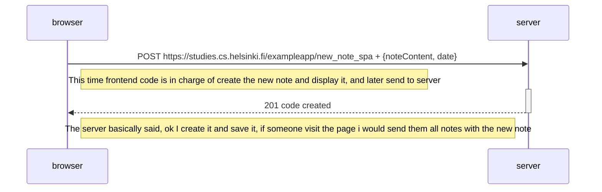

```mermaid
    sequenceDiagram
        participant browser
        participant server
        
        browser->>server: POST https://studies.cs.helsinki.fi/exampleapp/new_note_spa + {noteContent, date}
    Note right of browser: This time frontend code is in charge of create the new note and display it, and later send to server
        activate server
        server-->>browser: 201 code created
        deactivate server
        Note right of browser: The server basically said, ok I create it and save it, if someone visit the page i would send them all notes with the new note

```